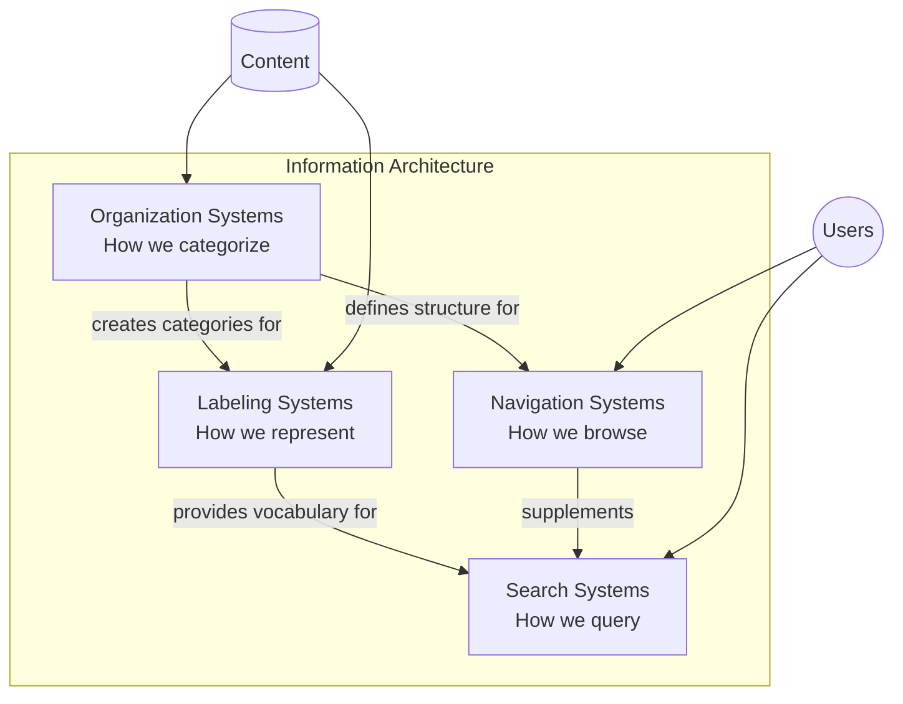
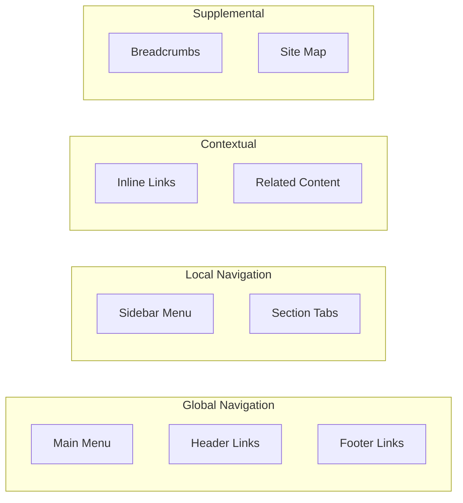
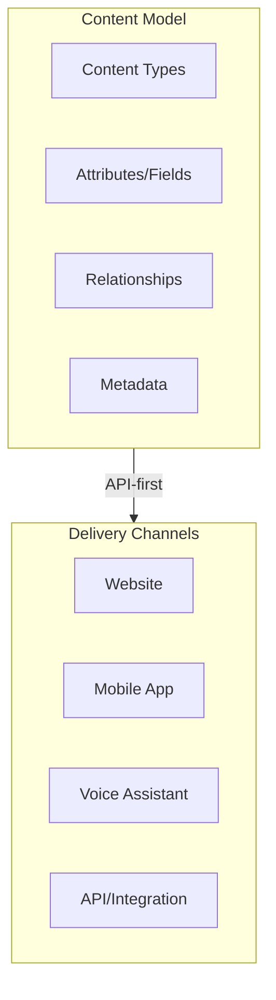

# Information Architecture

Design findable, usable content structures using the four IA systems: Organization, Labeling, Navigation, and Search.

## When to Use

- Designing website or application structure
- Creating taxonomies and categorization schemes
- Planning navigation systems and sitemaps
- Modeling content for headless CMS
- Conducting card sorting or tree testing
- Optimizing findability and information scent

## When NOT to Use

- Visual design (colors, typography, spacing)
- Interaction design (animations, micro-interactions)
- Frontend implementation (HTML/CSS/JS coding)
- Database schema design (use data modeling instead)

---

## Quick Start

1. **Audit**: Inventory existing content and user needs
2. **Organize**: Choose organization scheme (LATCH)
3. **Label**: Define terminology and controlled vocabulary
4. **Navigate**: Design navigation patterns
5. **Validate**: Test with tree testing or card sorting

---

## The Four IA Systems

| System | Purpose | Key Deliverables |
|--------|---------|------------------|
| **Organization** | How content is categorized | Taxonomies, hierarchies, facets |
| **Labeling** | How content is named | Controlled vocabulary, naming conventions |
| **Navigation** | How users browse | Sitemaps, menus, breadcrumbs |
| **Search** | How users query | Filters, facets, autocomplete |

---

## Core Procedure

### Phase 1: Research and Discovery

**Goal**: Understand users, content, and context.

- [ ] Conduct stakeholder interviews (business goals, constraints)
- [ ] Perform content audit (inventory, gap analysis)
- [ ] Research user mental models (interviews, analytics)
- [ ] Analyze competitors and analogous systems

**Checkpoint**: Document findings in research summary.

### Phase 2: Organization Design

**Goal**: Define how content will be categorized.

1. **Choose organization scheme** (LATCH):
   - **L**ocation: Geographic/spatial
   - **A**lphabet: A-Z ordering
   - **T**ime: Chronological
   - **C**ategory: Topical grouping
   - **H**ierarchy: Ranked by importance

2. **Design taxonomy**:
   - Flat (single-level terms)
   - Hierarchical (parent-child tree)
   - Faceted (multiple dimensions)
   - Polyhierarchical (multiple parents)

3. **Define metadata schema**:
   - Required fields per content type
   - Controlled vocabulary terms
   - Relationship types

**Checkpoint**: Taxonomy documented with 3+ levels and example content assigned.

### Phase 3: Labeling Design

**Goal**: Create consistent, user-friendly terminology.

- [ ] Extract user vocabulary from research
- [ ] Define controlled vocabulary (preferred terms)
- [ ] Map synonyms and aliases
- [ ] Document naming conventions
- [ ] Create labeling style guide

**Checkpoint**: Labeling guide with 10+ key terms defined.

### Phase 4: Navigation Design

**Goal**: Design how users will move through content.

| Pattern | Use When |
|---------|----------|
| **Global Nav** | Site-wide access to main sections |
| **Local Nav** | Section-specific navigation |
| **Breadcrumbs** | Deep hierarchies (3+ levels) |
| **Faceted Nav** | Product catalogs, search results |
| **Mega Menu** | Large sites with many categories |

- [ ] Create sitemap diagram
- [ ] Define navigation patterns per section
- [ ] Specify breadcrumb rules
- [ ] Plan search/filter integration

**Checkpoint**: Sitemap with 3-4 levels max, navigation patterns specified.

### Phase 5: Validation

**Goal**: Test IA against real user behavior.

**Card Sorting** (for organization):
1. Create cards for content items (30-60)
2. Recruit participants (15-20)
3. Run open or closed sort
4. Analyze similarity matrix
5. Refine taxonomy based on results

**Tree Testing** (for navigation):
1. Create text-only tree structure
2. Define findability tasks (10-15)
3. Recruit participants (50+)
4. Measure success rate and directness
5. Identify problem areas

**Checkpoint**: Validation results documented, IA refined based on findings.

---

## Definition of Done

- [ ] Content audit completed with gap analysis
- [ ] Taxonomy documented with controlled vocabulary
- [ ] Sitemap diagram created (max 4 levels deep)
- [ ] Navigation patterns specified for all sections
- [ ] Labeling guide with naming conventions
- [ ] Accessibility requirements addressed (WCAG 2.4)
- [ ] Validation method executed (card sort or tree test)

---

## Guardrails

### Do

- Keep hierarchies shallow (3-4 levels max)
- Use user vocabulary in labels (not internal jargon)
- Provide multiple paths to content
- Design for both browsing and searching
- Consider accessibility from the start

### Do Not

- Create deep nested structures (>5 levels)
- Use ambiguous or overlapping categories
- Ignore mental models revealed in research
- Skip validation before implementation
- Mix organization schemes inconsistently

### Accessibility Requirements

Per WCAG 2.4 (Navigable):
- Provide skip navigation links (2.4.1)
- Use descriptive page titles (2.4.2)
- Ensure logical focus order (2.4.3)
- Write descriptive link text (2.4.4)
- Offer multiple ways to find content (2.4.5)

See [references/accessibility.md](references/accessibility.md) for full WCAG navigation checklist.

---

## Deliverables

| Artifact | Format | Purpose |
|----------|--------|---------|
| **Sitemap** | Mermaid/diagram | Visual hierarchy of pages |
| **Taxonomy** | YAML/table | Controlled vocabulary structure |
| **Navigation Spec** | Markdown | Pattern definitions per section |
| **Labeling Guide** | Markdown | Naming conventions and vocabulary |
| **Content Model** | YAML/JSON | Fields and relationships |
| **Validation Report** | Markdown | Test results and recommendations |

---

## Content Modeling (Headless CMS)

For headless/omnichannel content:

**Principles**:
1. Separate content from presentation
2. Use modular, reusable components
3. Leverage reference fields (don't duplicate)
4. Plan for internationalization
5. Include SEO metadata as fields

See [references/content-modeling.md](references/content-modeling.md) for detailed patterns.

---

## Tools

**Sitemaps & Diagramming**: Figma, Miro, Mermaid, draw.io
**Card Sorting**: Optimal Workshop, UXtweak, Maze
**Tree Testing**: Treejack, UXtweak
**Taxonomy Management**: PoolParty, Neo4j, Notion
**Headless CMS**: Contentful, Strapi, Sanity, Hygraph

---

## References

- [IA Systems](references/ia-systems.md) - Deep dive on organization, labeling, navigation, search
- [Content Modeling](references/content-modeling.md) - Headless CMS patterns
- [Accessibility](references/accessibility.md) - WCAG navigation requirements
- [Examples](references/examples.md) - Sitemaps, taxonomies, navigation patterns

---

## Failure Modes & Recovery

| Failure | Symptom | Recovery |
|---------|---------|----------|
| Users can't find content | High bounce, poor task completion | Validate with tree testing, simplify hierarchy |
| Inconsistent labels | User confusion, support tickets | Create labeling guide, audit existing labels |
| Too many categories | Paralysis of choice | Apply 7+/-2 rule, use faceted navigation |
| Deep nesting | Lost users, poor breadcrumbs | Flatten hierarchy, add cross-links |
| Duplicate content paths | SEO issues, user confusion | Canonical paths, redirect strategy |
