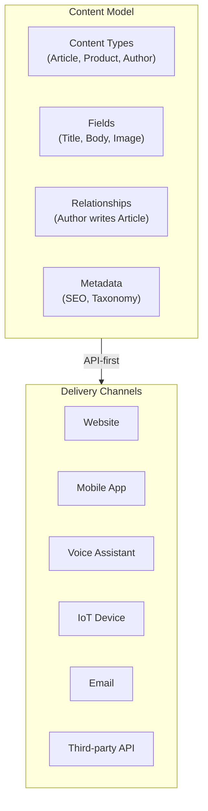
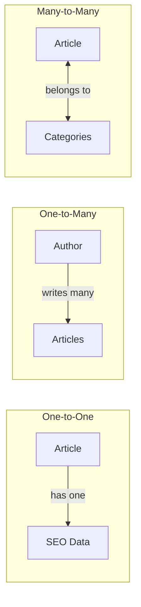
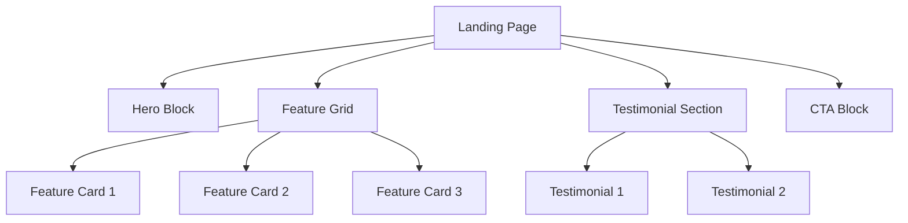

# Content Modeling for Headless Systems

Structured content design for omnichannel delivery.

---

## Core Principles

Content modeling separates **content** from **presentation**, enabling delivery across any channel.



### The Five Principles

| Principle | Description | Implementation |
|-----------|-------------|----------------|
| **Separation** | Content independent of layout | No formatting in content, no layout assumptions |
| **Modularity** | Reusable components | Heroes, CTAs, cards as blocks |
| **References** | Link, don't duplicate | Reference fields for shared content |
| **Internationalization** | Multi-language from start | Locale-aware field structure |
| **Metadata** | SEO and taxonomy built-in | Dedicated fields for discoverability |

---

## Content Type Design

### Anatomy of a Content Type

```yaml
content_type: Article
display_name: "Article"
api_id: article

fields:
  - name: title
    type: short_text
    required: true
    localized: true
    validations:
      - max_length: 100
    appearance: single_line

  - name: slug
    type: short_text
    required: true
    unique: true
    pattern: "^[a-z0-9-]+$"

  - name: body
    type: rich_text
    required: true
    localized: true
    allowed_elements:
      - headings
      - lists
      - links
      - images
      - embedded_entries

  - name: author
    type: reference
    required: true
    link_type: entry
    content_types: [author]

  - name: categories
    type: reference
    required: false
    link_type: entry
    content_types: [category]
    cardinality: many

  - name: published_date
    type: date_time
    required: true

  - name: seo
    type: embedded
    required: false
    content_type: seo_metadata
```

### Field Type Reference

| Field Type | Use Case | Example |
|------------|----------|---------|
| **Short text** | Titles, names | "Article Title" |
| **Long text** | Descriptions, excerpts | 500 char summary |
| **Rich text** | Body content | Formatted article |
| **Number** | Quantities, prices | 29.99 |
| **Date/DateTime** | Timestamps | 2026-01-24 |
| **Boolean** | Flags, toggles | is_featured: true |
| **Reference** | Links to other entries | author -> Author |
| **Media** | Images, files | hero_image.jpg |
| **JSON** | Structured data | product_specs |
| **Location** | Geographic coordinates | lat/lng |

---

## Relationship Patterns

### Reference Types



### Implementation Strategies

| Relationship | Content Type A | Content Type B | Strategy |
|--------------|----------------|----------------|----------|
| Article-Author | Reference field | Backlinks query | Author as separate type |
| Article-Category | Multi-reference | Backlinks query | Category taxonomy |
| Article-RelatedArticles | Multi-reference | Symmetric | Manual curation |
| Product-Variant | Parent reference | Child entries | Variant as child type |

---

## Page Model Patterns

### Templated Pages

Fixed structure, authors fill predefined areas.

```yaml
page_type: ProductPage
template: product_detail

sections:
  - hero:
      type: embedded
      content_type: hero_block
      required: true
  - product_info:
      type: reference
      content_type: product
      required: true
  - related_products:
      type: reference
      content_type: product
      cardinality: many
      max: 4
```

**Best for**: Marketing landing pages, product pages, legal pages

### Hybrid Pages

Fixed + dynamic sections.

```yaml
page_type: LandingPage
template: flexible_landing

sections:
  - hero:
      type: embedded
      content_type: hero_block
      required: true
  - dynamic_sections:
      type: reference
      content_types: [cta_block, feature_grid, testimonial_carousel, content_block]
      cardinality: many
      orderable: true
```

**Best for**: Campaign pages, feature pages, most content

### Fully Dynamic Pages

Authors control all layout.

```yaml
page_type: FlexiblePage
template: page_builder

sections:
  - blocks:
      type: reference
      content_types: [all_block_types]
      cardinality: many
      orderable: true
      nesting_allowed: true
```

**Best for**: Complex editorial, highly customized experiences

---

## Reusable Blocks

### Common Block Types

| Block | Fields | Use Case |
|-------|--------|----------|
| **Hero** | title, subtitle, image, cta | Page headers |
| **CTA** | text, link, style | Action prompts |
| **Feature Card** | icon, title, description, link | Feature grids |
| **Testimonial** | quote, author, photo, company | Social proof |
| **Content Block** | rich_text, alignment | Body content |
| **Image Gallery** | images[], layout | Visual content |
| **Video** | url, thumbnail, caption | Media embeds |
| **FAQ** | question, answer | Support content |

### Block Composition



---

## Taxonomy for Omnichannel

### Multi-Dimensional Classification

```yaml
taxonomy_dimensions:
  - dimension: industry
    terms: [healthcare, finance, retail, manufacturing]

  - dimension: persona
    terms: [developer, designer, product_manager, executive]

  - dimension: funnel_stage
    terms: [awareness, consideration, decision, retention]

  - dimension: content_type
    terms: [blog, case_study, whitepaper, video, webinar]

  - dimension: channel_optimization
    terms: [web, mobile, email, social, voice]
```

### Channel-Specific Considerations

| Channel | Content Requirements | Field Implications |
|---------|---------------------|-------------------|
| **Web** | Full content, SEO | All fields available |
| **Mobile** | Shorter content, touch | short_description field |
| **Email** | Plain text fallback | plain_text_excerpt |
| **Voice** | Speakable content | voice_summary, SSML |
| **Social** | Character limits | social_title, social_image |

---

## SEO Metadata Model

```yaml
content_type: SEOMetadata
api_id: seo_metadata

fields:
  - name: meta_title
    type: short_text
    required: true
    max_length: 60
    help_text: "Title for search results (max 60 chars)"

  - name: meta_description
    type: long_text
    required: true
    max_length: 160
    help_text: "Description for search results (max 160 chars)"

  - name: og_title
    type: short_text
    required: false
    help_text: "Override for social sharing"

  - name: og_description
    type: long_text
    required: false

  - name: og_image
    type: media
    required: false
    validations:
      - dimensions: 1200x630

  - name: canonical_url
    type: short_text
    required: false
    pattern: "^https?://"

  - name: robots
    type: short_text
    required: false
    default: "index,follow"

  - name: structured_data
    type: json
    required: false
    help_text: "JSON-LD for rich snippets"
```

---

## Migration Strategy

### From Page-Based to Structured

1. **Audit**: Inventory existing page templates
2. **Identify**: Extract reusable content blocks
3. **Model**: Design content types and relationships
4. **Map**: Create field mappings from old to new
5. **Migrate**: Transform and import content
6. **Validate**: Test all channels
7. **Redirect**: Update URLs if needed

### Content Migration Checklist

- [ ] All content types defined
- [ ] Field validations match legacy data
- [ ] Reference relationships mapped
- [ ] Media assets migrated
- [ ] Metadata preserved
- [ ] Taxonomy terms mapped
- [ ] Localized content handled
- [ ] Redirects configured
- [ ] API responses validated

---

## Platform Comparison

| Platform | Strengths | Best For |
|----------|-----------|----------|
| **Contentful** | Enterprise, ecosystem | Large teams, complex models |
| **Strapi** | Open source, customizable | Budget-conscious, custom needs |
| **Sanity** | Real-time, flexible schema | Collaborative, rapid iteration |
| **Hygraph** | GraphQL-native | API-heavy, developer-first |
| **Contentstack** | Enterprise, composable | Large enterprises |
| **DatoCMS** | Developer experience | JAMstack, static sites |

---

## References

- Atherton, M. & Hane, C. (2018). *Designing Connected Content*
- Hygraph. [Headless CMS Playbook](https://hygraph.com/resources)
- Contentful. [Content Modeling Guide](https://www.contentful.com/developers/docs/concepts/data-model/)
