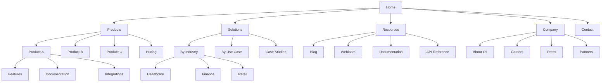
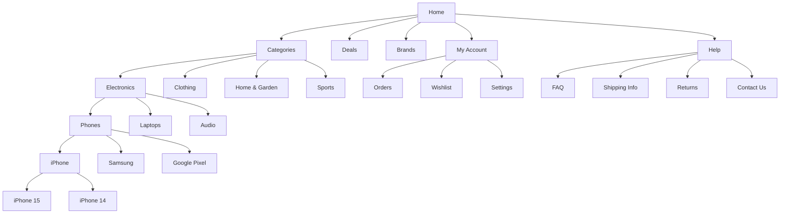

# IA Examples Library

Practical examples of sitemaps, taxonomies, and navigation patterns.

---

## Sitemap Examples

### Corporate Website



**Analysis**:
- 4 levels deep maximum
- Clear separation of concerns
- Multiple paths to content (Solutions by Industry AND by Use Case)
- Utility pages (Contact) at top level

### E-commerce Store



**Analysis**:
- Product hierarchy matches mental models
- Brand navigation as alternative path
- Account/Help as utility sections
- Faceted navigation supplements this hierarchy

---

## Taxonomy Examples

### Product Taxonomy (Hierarchical)

```yaml
taxonomy:
  name: Product Categories
  type: hierarchical

  terms:
    - name: Electronics
      children:
        - name: Computers
          children:
            - name: Laptops
            - name: Desktops
            - name: Tablets
        - name: Mobile Devices
          children:
            - name: Smartphones
            - name: Wearables
            - name: Accessories
        - name: Audio
          children:
            - name: Headphones
            - name: Speakers
            - name: Home Audio

    - name: Clothing
      children:
        - name: Men
          children:
            - name: Shirts
            - name: Pants
            - name: Outerwear
        - name: Women
          children:
            - name: Dresses
            - name: Tops
            - name: Bottoms
        - name: Children
          children:
            - name: Boys
            - name: Girls
            - name: Infants
```

### Faceted Taxonomy

```yaml
taxonomy:
  name: Product Attributes
  type: faceted

  facets:
    - name: Brand
      terms: [Apple, Samsung, Sony, Dell, HP, LG]

    - name: Price Range
      terms:
        - { label: "Under $50", value: "0-50" }
        - { label: "$50-$100", value: "50-100" }
        - { label: "$100-$500", value: "100-500" }
        - { label: "$500+", value: "500-" }

    - name: Customer Rating
      terms: [5 stars, 4+ stars, 3+ stars]

    - name: Availability
      terms: [In Stock, Pre-order, Coming Soon]

    - name: Features
      terms: [Wireless, Bluetooth, USB-C, Waterproof]
```

### Content Taxonomy (Blog)

```yaml
taxonomy:
  name: Blog Content
  type: multi-dimensional

  dimensions:
    - name: Topic
      type: hierarchical
      terms:
        - Technology
          - AI & Machine Learning
          - Cloud Computing
          - DevOps
        - Business
          - Strategy
          - Leadership
          - Finance
        - Design
          - UX Design
          - Visual Design
          - Research

    - name: Content Type
      type: flat
      terms: [Tutorial, Case Study, Opinion, News, Interview]

    - name: Audience Level
      type: flat
      terms: [Beginner, Intermediate, Advanced]

    - name: Author
      type: flat
      terms: [linked to Author content type]
```

---

## Navigation Pattern Examples

### Global Navigation

```
+------------------------------------------------------------------+
| Logo    Products  Solutions  Resources  Company  [Search] [Login] |
+------------------------------------------------------------------+
```

**Implementation**:
```html
<nav aria-label="Main navigation">
  <ul>
    <li><a href="/products">Products</a></li>
    <li><a href="/solutions">Solutions</a></li>
    <li><a href="/resources">Resources</a></li>
    <li><a href="/company">Company</a></li>
  </ul>
</nav>
```

### Mega Menu

```
+------------------------------------------------------------------+
|                           Products                                 |
+------------------------------------------------------------------+
| Product A          | Product B          | Product C              |
| - Features         | - Features         | - Features             |
| - Pricing          | - Pricing          | - Pricing              |
| - Documentation    | - Documentation    | - Documentation        |
|                    |                    |                        |
| [Compare Products] | [View All Products] | [Request Demo]        |
+------------------------------------------------------------------+
```

**Use when**:
- 20+ categories
- Need to expose 2 levels at once
- Have featured/promotional content
- Complex product offerings

### Breadcrumbs

```
Home > Products > Electronics > Phones > iPhone 15 Pro
```

**Implementation**:
```html
<nav aria-label="Breadcrumb">
  <ol>
    <li><a href="/">Home</a></li>
    <li><a href="/products">Products</a></li>
    <li><a href="/products/electronics">Electronics</a></li>
    <li><a href="/products/electronics/phones">Phones</a></li>
    <li aria-current="page">iPhone 15 Pro</li>
  </ol>
</nav>
```

### Sidebar Navigation

```
+-------------------+
| Section Name      |
+-------------------+
| > Overview        |
|   Getting Started |
|   Installation    |
| v Guides          |
|     Tutorial 1    |
|     Tutorial 2    |
|     Tutorial 3    |
|   API Reference   |
|   FAQ             |
+-------------------+
```

**Use when**:
- Deep documentation
- Section has 10+ pages
- Users need orientation
- Sequential content

### Faceted Navigation

```
+-------------------+
| Filters           |
+-------------------+
| Category          |
| [ ] Laptops (45)  |
| [ ] Desktops (23) |
| [x] Tablets (12)  |
+-------------------+
| Brand             |
| [x] Apple (8)     |
| [ ] Samsung (3)   |
| [ ] Microsoft (1) |
+-------------------+
| Price             |
| [====|----] $500  |
| $0    $2000       |
+-------------------+
| [Clear All]       |
+-------------------+
```

**Implementation notes**:
- Show counts per filter value
- Update counts dynamically
- Allow multiple selections
- Provide clear all option

---

## Card Sorting Results Example

### Similarity Matrix

```
                 Item A  Item B  Item C  Item D  Item E
Item A             -      85%    72%     15%     20%
Item B            85%      -     68%     12%     18%
Item C            72%     68%     -      45%     40%
Item D            15%     12%    45%      -      92%
Item E            20%     18%    40%     92%      -
```

**Interpretation**:
- Items A & B strongly associated (85%)
- Items D & E strongly associated (92%)
- Items A/B weakly associated with D/E
- Two clear category groups emerging

### Dendrogram

```
                    +----- Item A
              +-----|
              |     +----- Item B
Root ---------|
              |     +----- Item C
              |     |
              +-----|     +----- Item D
                    +-----|
                          +----- Item E
```

**Interpretation**:
- Two main branches
- Item C bridges both groups
- Consider: Is C in right category?

---

## Content Model Example

### Blog Article Model

```yaml
content_type: Article
api_id: article

fields:
  # Core Content
  - name: title
    type: short_text
    required: true
    localized: true

  - name: slug
    type: short_text
    required: true
    unique: true

  - name: excerpt
    type: long_text
    required: true
    max_length: 300

  - name: body
    type: rich_text
    required: true

  - name: featured_image
    type: media
    required: true

  # Relationships
  - name: author
    type: reference
    content_types: [author]
    cardinality: one
    required: true

  - name: categories
    type: reference
    content_types: [category]
    cardinality: many
    required: true

  - name: tags
    type: reference
    content_types: [tag]
    cardinality: many

  - name: related_articles
    type: reference
    content_types: [article]
    cardinality: many
    max: 3

  # Metadata
  - name: published_date
    type: datetime
    required: true

  - name: seo
    type: embedded
    content_type: seo_metadata

  # Taxonomy
  - name: content_type
    type: short_text
    enum: [tutorial, case_study, opinion, news]
    required: true

  - name: audience_level
    type: short_text
    enum: [beginner, intermediate, advanced]
```

### Author Model

```yaml
content_type: Author
api_id: author

fields:
  - name: name
    type: short_text
    required: true

  - name: slug
    type: short_text
    required: true
    unique: true

  - name: bio
    type: long_text
    max_length: 500

  - name: avatar
    type: media

  - name: social_links
    type: json
    schema:
      twitter: string
      linkedin: string
      github: string
```

---

## Tree Testing Task Examples

### E-commerce Tasks

| Task | Expected Path | Success Criteria |
|------|---------------|------------------|
| Find iPhone 15 cases | Electronics > Mobile > Accessories | Direct: 1 path |
| Check order status | My Account > Orders | Direct: 1-2 paths |
| Find return policy | Help > Returns | Direct: 1 path |
| Compare laptop prices | Electronics > Computers > Laptops > Compare | Indirect OK |
| Contact customer service | Help > Contact Us | Direct: 1 path |

### Documentation Tasks

| Task | Expected Path | Success Criteria |
|------|---------------|------------------|
| Install the SDK | Getting Started > Installation | Direct: 1 path |
| Find API authentication docs | API Reference > Authentication | Direct: 1-2 paths |
| Troubleshoot error 500 | Guides > Troubleshooting | Indirect OK |
| View changelog | Resources > Changelog | Direct: 1 path |
| Find code examples | Guides > Examples OR API Reference > Examples | Multiple valid |

### Metrics to Track

| Metric | Target | Description |
|--------|--------|-------------|
| **Success rate** | >80% | % of users completing task |
| **Directness** | >60% | % finding content on first try |
| **Time on task** | <30s | Average time to find content |
| **Path length** | <4 clicks | Average clicks to destination |

---

## Anti-Patterns to Avoid

### Too Deep

```
Home > Products > Electronics > Computers > Laptops > Gaming > 15-inch > NVIDIA > RTX 4090
```
**Problem**: 8 levels, users get lost

### Inconsistent Labeling

```
Navigation: "Items" -> Page: "Products" -> URL: /merchandise
```
**Problem**: Three different terms for same concept

### Overlapping Categories

```
Categories:
- New Arrivals
- Electronics  <- contains new arrivals
- Featured     <- contains new arrivals
- Deals        <- contains new arrivals
```
**Problem**: Same item in multiple paths, user confusion

### No Navigation Backup

```
Search-only interface, no browse categories
```
**Problem**: Users who don't know what to search for can't explore

---

## Templates

### Sitemap Documentation Template

```markdown
# [Site Name] Sitemap

## Overview
- Total pages: [X]
- Max depth: [X] levels
- Last updated: [Date]

## Primary Navigation
[Mermaid diagram]

## Section: [Name]
- Purpose: [Why this section exists]
- Pages: [List with URLs]
- Cross-links: [Links to other sections]

## Utility Pages
- [List: contact, privacy, terms, etc.]

## Notes
- [Design decisions]
- [Known issues]
```

### Taxonomy Documentation Template

```markdown
# [Taxonomy Name]

## Overview
- Type: [flat/hierarchical/faceted]
- Purpose: [What it classifies]
- Owner: [Who maintains it]

## Terms

### [Top-level term]
- Definition: [Scope note]
- Children: [List]
- Related: [Cross-references]

## Governance
- Add terms: [Process]
- Review cycle: [Frequency]
- Change log: [Link]
```
