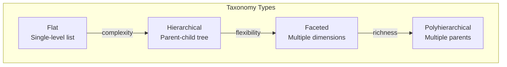
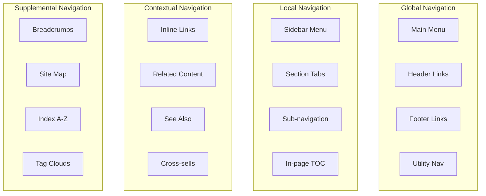
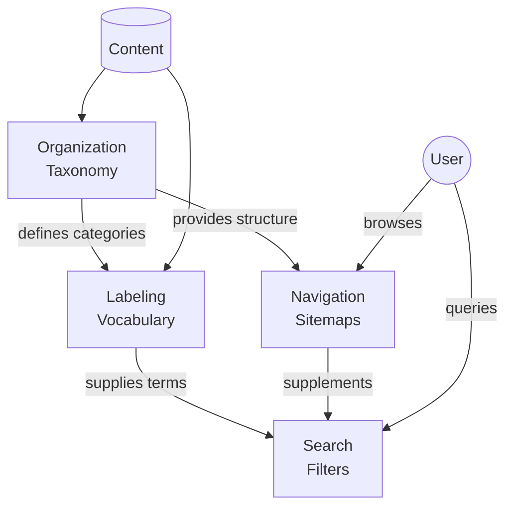

# IA Systems Deep Dive

The four foundational systems of Information Architecture (Rosenfeld & Morville).

---

## Organization Systems

How content is categorized and structured.

### LATCH Schemes (Wurman)

The five fundamental ways to organize information:

| Scheme | Description | Example | Best For |
|--------|-------------|---------|----------|
| **L**ocation | Geographic/spatial | Maps, floor plans | Physical spaces, regional content |
| **A**lphabet | A-Z ordering | Dictionaries, directories | Reference, when order irrelevant |
| **T**ime | Chronological | Timelines, calendars | Events, history, versions |
| **C**ategory | Topical grouping | Product catalogs | Most content, domain-based |
| **H**ierarchy | Ranked importance | Org charts, popularity | Priority-based, size-based |

### Taxonomy Types



**Flat Taxonomy**:
- Simple list of terms
- No relationships
- Use for: Tags, simple filtering

**Hierarchical Taxonomy**:
- Tree structure (parent-child)
- Single inheritance
- Use for: Product categories, documentation

**Faceted Taxonomy**:
- Multiple independent dimensions
- Combinatorial filtering
- Use for: E-commerce, complex search

**Polyhierarchical Taxonomy**:
- Items can have multiple parents
- Network structure
- Use for: Complex domains, research

### Taxonomy Governance

| Activity | Frequency | Responsibility |
|----------|-----------|----------------|
| Add new terms | As needed | Content authors |
| Review/approve terms | Weekly | Taxonomy owner |
| Merge/split categories | Quarterly | IA team |
| Full audit | Annually | IA + stakeholders |

**Documentation Requirements**:
- Scope notes (when to use each term)
- Broader/narrower relationships
- Related terms
- Use/used-for (synonyms)
- History (changes over time)

---

## Labeling Systems

How content is named and described.

### Label Types

| Type | Purpose | Example |
|------|---------|---------|
| **Contextual links** | Inline navigation | "Learn more about pricing" |
| **Headings** | Section organization | H1, H2, H3 hierarchy |
| **Navigation labels** | Menu items | "Products", "Services" |
| **Index terms** | Search/filtering | Tags, keywords |

### Labeling Best Practices

**Do**:
- Use user vocabulary (from research)
- Be specific over generic
- Front-load important words
- Maintain parallel structure
- Test labels with users

**Don't**:
- Use internal jargon
- Use ambiguous terms
- Mix noun and verb forms
- Create overlapping categories
- Assume understanding

### Controlled Vocabulary Structure

```yaml
term: "Artificial Intelligence"
preferred_label: "AI"
broader_terms:
  - "Technology"
  - "Computer Science"
narrower_terms:
  - "Machine Learning"
  - "Natural Language Processing"
  - "Computer Vision"
related_terms:
  - "Automation"
  - "Data Science"
use_for:
  - "AI"
  - "Artificial Intelligence"
  - "Machine Intelligence"
scope_note: "Computer systems that perform tasks normally requiring human intelligence"
```

---

## Navigation Systems

How users browse and move through content.

### Navigation Pattern Types



### Pattern Selection Guide

| Pattern | Use When | Implementation Notes |
|---------|----------|---------------------|
| **Global Nav** | Always | Consistent across all pages |
| **Local Nav** | Sections with 3+ pages | Shows siblings and children |
| **Breadcrumbs** | Hierarchies 3+ levels | Reflects actual hierarchy |
| **Faceted Nav** | Large catalogs | Combine with search |
| **Mega Menu** | 20+ categories | Expose 2 levels at once |
| **Progressive Disclosure** | Complex apps | Reveal based on context |
| **Skip Links** | Always (accessibility) | First focusable element |

### Navigation Depth Guidelines

| Depth | Click Path | Recommended Max Items |
|-------|------------|----------------------|
| Level 1 | Homepage | 5-7 main categories |
| Level 2 | Category page | 7-10 subcategories |
| Level 3 | Subcategory | 10-15 items |
| Level 4+ | Detail pages | Avoid if possible |

**Rule of thumb**: 80% of content should be reachable in 3 clicks or less.

---

## Search Systems

How users query and filter content.

### Search Components

| Component | Purpose | Implementation |
|-----------|---------|----------------|
| **Search box** | Query input | Prominent, accessible |
| **Autocomplete** | Query assistance | Suggest terms, correct spelling |
| **Filters** | Narrow results | Facets, date ranges |
| **Results page** | Display matches | Relevance, sorting options |
| **No results** | Handle failures | Suggestions, alternatives |

### Search Pattern Selection

| Content Volume | Primary Strategy | Secondary Strategy |
|----------------|------------------|-------------------|
| < 100 items | Navigation only | Simple search |
| 100-1,000 | Navigation + search | Basic filters |
| 1,000-10,000 | Search + navigation | Faceted filters |
| 10,000+ | Search-first | Advanced filtering |

### Faceted Search Design

```mermaid
flowchart LR
    subgraph Query["User Query"]
        Q[Search: "laptop"]
    end

    subgraph Facets["Facets"]
        F1[Brand<br/>Apple, Dell, HP...]
        F2[Price<br/>$0-500, $500-1000...]
        F3[Screen<br/>13", 15", 17"...]
        F4[RAM<br/>8GB, 16GB, 32GB...]
    end

    subgraph Results["Filtered Results"]
        R[245 laptops found]
    end

    Query --> Facets
    Facets --> Results
```

**Facet Design Principles**:
- Order facets by importance/frequency
- Show item counts per facet value
- Allow multiple selections per facet
- Provide "clear all" option
- Remember selections across sessions

---

## System Integration

The four systems work together:



**Integration Points**:
1. Taxonomy categories become navigation items
2. Controlled vocabulary powers search autocomplete
3. Metadata enables faceted filtering
4. Labels create information scent in navigation
5. Search analytics inform navigation priorities

---

## References

- Rosenfeld, L., Morville, P., & Arango, J. (2015). *Information Architecture for the Web and Beyond* (4th ed.)
- Wurman, R. S. (1989). *Information Anxiety*
- Nielsen Norman Group: [IA Articles](https://www.nngroup.com/topic/information-architecture/)
